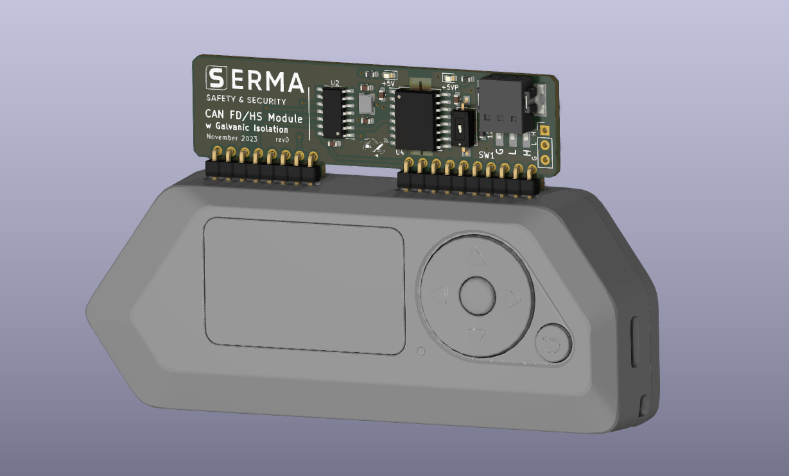

[WIP] **Flipper Zero CAN FD HS Module Board**

** /!\ All informations are Work In Progress and are subject to modifications without notice /!\ **

This Gitlab repository contains the development files of the Flipper Zero CAN FD HS Module Board. 

The Flipper Zero CAN FD HS Module Board is a custom electronic board designed by SERMA Safety & Security to enable a Flipper Zero to 
use CAN FD / HS protocol and thus communicate with ECU's or others devices. 

The  FP 0 CAN FD HS Module embeds the following features : 

* 1x CAN Transreceiver
The CAN function is performed using a Microchip MCP2518FD which supports both CAN 2.0B(HS) and CAN FD.
The device is able to communicate at a data rate of up 8 Mbits/s on CAN FD 

* 1x CAN Isolator
The FP 0 CAN FD HS Module of an isolation of the CAN network to protect humans against electric shock and prevent sensible electronics to be damage by high voltage.
This function is performed thanks to the usage of the NXP TJA1052IT which use a proprietary solution offering a communication of 5Mbits/s on CAN FD. 

* 1x Screwless header block
To offer an easy usage of the FP 0 CAN FD HS Module, the board embeds a Phoenix Contact PTSM header blocks which allows quick and reliable connection of cables.

* 1x Optionnal 2.54mm
For application that requires strong mechanical constraints, CAN signals can be directly solder onto available through holes. 

* Power ON Indicators
To indicate safe operation of the board. 

* 1x 120 Ohm user controlled resistor

